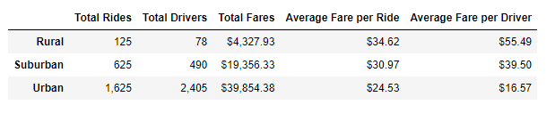
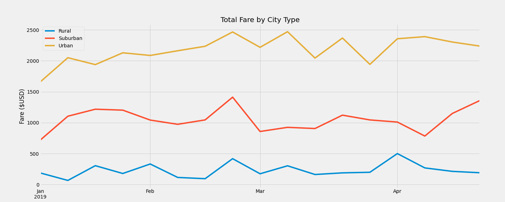

# PyBer_Analysis

## Overview

  The purpose of this new analysis was to provide a single succinct visual to provide a high-level overview of the fares over time across the different markets. The new graph took the existing data frames, sorting and grouping with two indexes (date and type) into a new data frame, and resampling the dates to show a week-over-week comparison line chart. This will help V. Isualize make business decisions such as future marketing, pricing, and potential hiring across the different city types depending on the direction the company takes for growth opportunities.
    
## Results
  The summary dataframe show the major differences in rides, drivers, and fares across city types. As one might expect, a major difference across these locations is the size of the market. There are both more drivers and rides taken as you move from the rural cities to suburban then rural. The total fares collected follows this pattern, with the highest fare total in urban, lowest in rural, and suburban in the middle. 

The average fare per driver and ride tell a different story, however. These metrics are the lowest in the urban cities, and highest in rural, with suburban again taking the middle position. Another notable difference is the ratio of drivers to rides. In Rural and Suburban there were more rides than drivers while Urban had more drivers than rides. Each of these observations can be made when looking at the summary dataframe seen below.

#### Summary Metrics DataFrame

In the week by week chart that we have prepared for V. Isualize seen below, it is clear the total fare amounts are pretty consistent in a given market over time. 

## Summary and Recommendations

In order to spur growth and increased revenue for Pyber, I have the following recommendations for the CEO based on the data we have seen in this analysis.

  - **Increase marketing efforts in Urban centers.**
        - There is a surplus of drivers in the urban population centers, and the ride costs are low relative to the other markets. Increasing the amount of riders is ideal to fully utilize the number of drivers available.
  - **Prioritize hiring drivers in underserved markets.**
        - Increasing the number of drivers in rural and suburban markets will serve to both bring down the end-user cost and potentially increase fares brought in by reducing wait time and becoming a more attractive alternative to other travel options in those areas.
  - **Offer discount codes in rural and suburban markets.**
        - Higher prices due to limited availibility might be off-putting for consumers, so limited time price-breaks or discount codes might bring in a larger audience. Use this method carefully if also bringing in drivers so as to not lose money on these markets.

